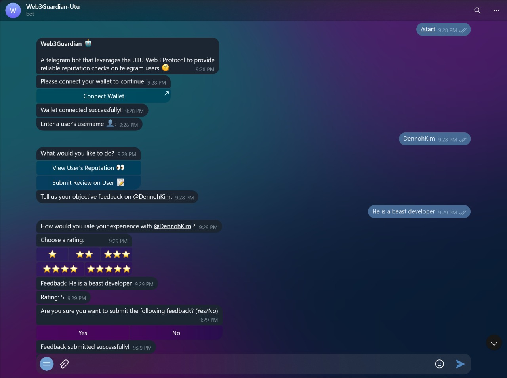

# Project Title: UTU Protocol Web3Guardian Telegram Bot

## Screenshot
 

## Demo Video

## Table of Contents
- [Team Members](#Team Members)
- [Description](#Description)
- [Problem Statement](#ProblemStatement)
- [Key Features](#KeyFeatures)
- [Usage](#Usage)
- [Local Installation and Contribution Guidelines](#LocalInstallationandCotributionGuidelines)
- [Demo Video  & ScreenShots(WIP)](#DemoVideo&ScreenShots(WIP))
- [License](#License)
- [Contact](#contact)

## Team Members
This is a project submission for the [ETHSafari](https://taikai.network/ethsafari/hackathons/ethsafari) Bootckathon competition. The project was executed by a team of 5 namely:
- Dennis Kimathi ([@DennohKim](https://github.com/DennohKim)) - Team Leader
- Moses Odhiambo ([@badass-techie](https://github.com/badass-techie)) - Full Stack Developer
- Hawa Maria
- Hazard Krypto ([@iBrainiac](https://github.com/iBrainiac))
- [Scoffie](https://github.com/LeviScoffie)


## Description
Web3Guardian is a powerful and user-friendly telegram bot that leverages the **UTU** protocol's trust engine to enhance trustworthiness in online digital interactions.

The bot allows users to securely give and receive feedback from other users on Telegram, strengthening their reputation.

## Problem Statement
The online space has been marred with malicious actors and spam, specifically on telegram. By using our UTU Web3Guardian bot, you will be able to identify bad actors and therefore protect yourself from fraudulent activities such as:
- Revealing your PII (Personally Identifiable Information) to malicious groups.

- Losing funds to scammers and grifters.

## Key Features
- **Submit Feedback:** Write reviews for a user and provide them a  rating based on the provided context.

- **View Reputation:** Check out a user's reputation (feedback and rating) given by other users and entities that interacted with the bot before.

- **Decentralized Storage:** Create, store, and manage reviews and feedback in UTU's decentralized protocol.

- **Wallet Integration:**  A web3 wallet connector, and sign a verification message to be able to interact with the _Web3Guadian_ Telegram bot.

## Usage
To use the UTU Web3Guardian Telegram Bot, follow these steps:
1. Navigate to your web browser of choice and click this [link](https://t.me/web3guardian_utu_bot) to redirect you to Web3Guardian (UTU) telegram bot.

2. Click ```/start``` and connect your web3 wallet extension of choice (e.g. Metamask)

3. Enter a username whose review or feedback you want to view or give.

4. Choose whether you want to **View a User's Reputation** or **Submit a Review on a User**.

5. Based on your choice in step 4 above:-
    - _The first option returns the reviews given by other users and yours as well_.
    - _Write down feedback for a user and give them a rating on a scale of 1-5 if you choose the 2nd option_.

6. Confirm your choice and click ```/start``` to start another session or ```/reset``` to reset the bot.

## Local Installation and Contribution Guidelines
### Prerequisites
- A publicly accessible environment (either a cloud server or a local machine exposed to the internet)
- [Git](https://git-scm.com/downloads)
- [Docker](https://docs.docker.com/install/)

### Installation

Assuming you are in a development setup:

1. Clone the project's github repository. 
```bash
git clone git@github.com:DennohKim/web3guardian--utu-bot.git
```

2. Navigate to the project directory:
```bash
cd web3guardian--utu-bot
```

3. Create your own `.env` file using the template provided after acquiring your specific bot token. Guidance on how to generate your bot token can be found [HERE](https://medium.com/geekculture/generate-telegram-token-for-bot-api-d26faf9bf064). The redis host is `redis` and the port is `6379`. The base_url is `http://localhost:3000` in a development setup.

4. Build and start the docker containers by running the command
 ```bash 
docker compose up
```

5. Navigate to another terminal and expose the your localhost to the internet using ngrok by running the command
```bash 
ngrok http 3000
```
This is so that the telegram bot can be able to send requests to your localhost
- Ps. You will have to install **ngrok** using 
 ```bash 
 sudo snap install ngrok
 ```

6. Once everything is up and running, you can follow the steps outlined in the [**Usage**](#Usage) section above to interact with the Telegram bot.


## License
The **UTU** Web3Guardian Telegram Bot is open-source software licensed under the [MIT License](https://github.com/git/git-scm.com/blob/main/MIT-LICENSE.txt)
## Contact
For questions, suggestions, or support, please contact our team [HERE](https://github.com/DennohKim).
